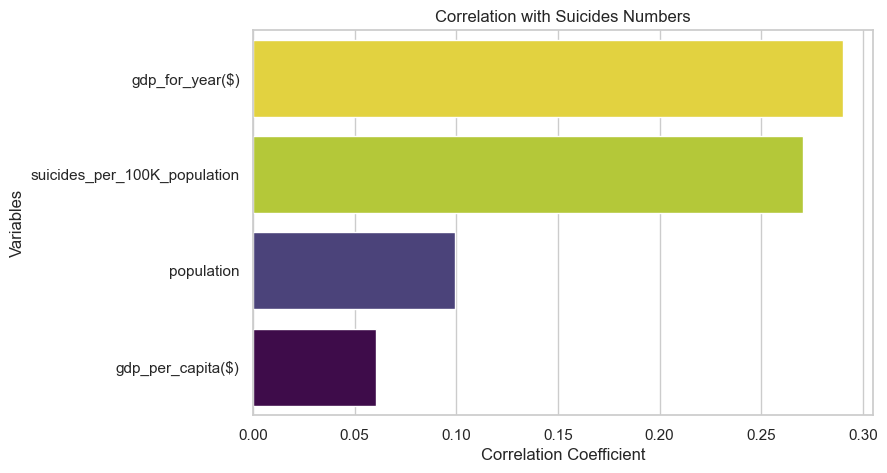

# **GLOBAL SUICIDE RATES (1985 - 2016): INSIGHTS FOR EFFECTIVE PREVENTION** 


## **TABLE OF CONTENTS**
- [Introduction](#project-overview)
- [Data Overview](#data-overview)
  - [Dataset Description](#dataset-description)
  - [Data Sources](#data-sources)
  - [Data Preprocessing](#data-preprocessing)
- [Exploratory Data Analysis (EDA)](#eda)
  - [Temporal Trends](#temporal-trends)
  - [Regional Patterns](#regional-patterns)
  - [Demographic Analysis](#demographic-analysis)
  - [Economic Factors](#economic-factors)
  - [Population Influence](#population-influence)
- [Correlation Analysis](#correlation-analysis)
  - [Relationships between Variables](#relationships-between-variables)
  - [Insights from Correlation Patterns](#insights-from-correlation-patterns)
- [Challenges and Considerations](#challenges-and-considerations)
  - [Data Quality](#data-quality)
  - [Ethical Handling of Sensitive Information](#ethical-handling-of-sensitive-information)
  - [Complexity of Factors](#complexity-of-factors)
- [Conclusion](#conclusion)
  - [Summary of Findings](#summary-of-findings)
  - [Implications for Suicide Prevention](#implications-for-suicide-prevention)
- [References](#references)
- [Appendix](#appendix)
  - [Additional Visualizations](#additional-visualizations)
  - [Supplementary Information](#supplementary-information)


<a id='projectsummary'></a>
***
## **PROJECT OVERVIEW**

### **Introduction**

*According to WHO, every year 703,000 people take their own life, with an additional number attempting suicide. Each suicide is a tragedy that profoundly affects families, communities, and entire countries, leaving lasting impacts on those left behind. Occurring across the lifespan, suicide ranked as the fourth leading cause of death among 15–29-year-olds globally in 2019. Importantly, suicide is not confined to high-income countries; it is a global phenomenon affecting all regions. In 2019, over 77% of global suicides occurred in low- and middle-income countries.*

### **Summary**

*This project embarks on a comprehensive Exploratory Data Analysis (EDA) of global suicide rates spanning 1985 to 2021. Aligned with the World Health Organization's (WHO) stance that suicide is a preventable public health issue, my objective is to discern correlations between suicide rates and various socio-economic factors. The dataset incorporates critical information, including country, year, suicides, population, GDP indicators, age groups, gender, and more.*

<a id='projectobjectives'></a>
### **Objectives**

*The primary goal is to unearth insights that can inform evidence-based suicide prevention strategies. By scrutinizing temporal trends, regional variations, demographic influences, and economic correlations (see [Correlation Analysis](#correlation-analysis)), I aim to contribute to the global effort in reducing suicide rates one visual at a time.*

### **Hypothesis**

*I hypothesize that certain demographic factors, economic conditions, and crisis-related triggers significantly influence suicide rates. Identifying these correlations will enable the formulation of targeted prevention strategies.*

### **Potential Challenges**

- *Data quality (see [Challenges and Considerations](#challenges-and-considerations)): Ensuring the reliability and accuracy of the dataset is crucial for drawing valid conclusions.*
- *Sensitivity (see [Challenges and Considerations](#challenges-and-considerations)): Handling sensitive information related to mental health and suicide requires ethical considerations and careful communication.*
- *Complexity of factors (see [Challenges and Considerations](#challenges-and-considerations)): Suicide is a multifaceted issue influenced by numerous interconnected factors, making it challenging to isolate specific causes.*

<a id='expected-findings'></a>
### **Expected Findings**

- *Demographic vulnerabilities (see [Vulnerable Groups](#vulnerable-groups)): Identification of age groups, genders, and vulnerable populations susceptible to higher suicide rates.*
- *Economic impact (see [Economic Factors](#economic-factors)): Insight into the relationship between economic indicators and suicide rates globally and regionally.*
- *Multisectoral strategies (see [Multisectoral Strategies](#multisectoral-strategies)): Recommendations for comprehensive suicide prevention strategies based on the identified correlations.*

By addressing these objectives and potential challenges, this project aspires to contribute meaningful insights to the ongoing global effort to understand and mitigate the impact of suicide.


---
<a id='data-overview'></a>
## **DATA OVERVIEW**

<a id='dataset-description'></a>
### **Data description**
This dataset serves as an extension to the original compilation and is sourced from four distinct datasets. It is designed to explore correlations linked to increased suicide rates among different cohorts globally, spanning the socio-economic spectrum.

The dataset includes the following key variables:

- Country
- Year
- Sex
- Age group
- Count of suicides
- Population
- Suicide rate
- Country-year composite key
- Human Development Index (HDI) for the year
- Gross Domestic Product (GDP) for the year
- GDP per capita
- Generation (based on age grouping average)

<a id='data-sources'></a>
### **Data Sources**

The dataset is compiled from the following references:

1. **United Nations Development Program (UNDP):**
   - Source: [Human Development Index (HDI)](http://hdr.undp.org/en/indicators/137506)
   - Year: 2018

2. **World Bank:**
   - Source: [World Development Indicators: GDP (current US$) by country: 1985 to 2016](http://databank.worldbank.org/data/source/world-development-indicators#)
   - Year: 2018

3. **[Szamil] on Kaggle:**
   - Source: [Suicide in the Twenty-First Century dataset](https://www.kaggle.com/szamil/suicide-in-the-twenty-first-century/notebook)
   - Year: Not specified (dataset year may vary)

4. **World Health Organization (WHO):**
   - Source: [Suicide Prevention](http://www.who.int/mental_health/suicide-prevention/en/)
   - Year: 2018

<a id='data-preprocessing'></a>
### **Data Preprocessing**
This section outlines the steps taken to prepare the suicide rates dataset for analysis. It covers data loading, cleaning, renaming columns, handling numeric values, and addressing missing values. This preprocessing aims to ensure the dataset's reliability and suitability for subsequent analysis.

<a id='import-packages'></a>
#### **1. Import Packages**

Before starting the analysis, let's install and import the required Python packages.


```python
# !pip install opendatasets pandas matplotlib seaborn numpy
```


```python
import opendatasets as od
import pandas as pd
import matplotlib.pyplot as plt
import seaborn as sns
import numpy as np
```

#### **2. Dataset download and loading**
- Download the dataset from Kaggle using the `opendatasets` library.
- Loaded into a Pandas DataFrame named `suicide_rates_df`.


```python
# Download the dataset from Kaggle using opendatasets
dataset_url = "https://www.kaggle.com/datasets/omkargowda/suicide-rates-overview-1985-to-2021"
od.download(dataset_url)
```

    Skipping, found downloaded files in ".\suicide-rates-overview-1985-to-2021" (use force=True to force download)
    


```python
# Read the dataset into a Pandas DataFrame
suicide_rates_df = pd.read_csv('./data/suicide_rates_1985_to_2021.csv',)
```

#### **3. Exploratory Data Analysis (EDA)**
- Explore the dataset's shape, info, and descriptive statistics.
- Displayed the first 5 rows, last 5 rows, and a random sample of 10 row.


```python
# Display the shape of the dataset (number of rows and columns)
suicide_rates_df.shape
```


    (31756, 12)


```python
# Display information about the dataset, including column names, non-null counts, and data types
suicide_rates_df.info()
```

    <class 'pandas.core.frame.DataFrame'>
    RangeIndex: 31756 entries, 0 to 31755
    Data columns (total 12 columns):
     #   Column              Non-Null Count  Dtype  
    ---  ------              --------------  -----  
     0   country             31756 non-null  object 
     1   year                31756 non-null  int64  
     2   sex                 31756 non-null  object 
     3   age                 31756 non-null  object 
     4   suicides_no         30556 non-null  float64
     5   population          31756 non-null  int64  
     6   suicides/100k pop   31756 non-null  float64
     7   country-year        31756 non-null  object 
     8   HDI for year        12300 non-null  float64
     9    gdp_for_year ($)   31756 non-null  object 
     10  gdp_per_capita ($)  31756 non-null  float64
     11  generation          31756 non-null  object 
    dtypes: float64(4), int64(2), object(6)
    memory usage: 2.9+ MB
    


```python
# Display basic descriptive statistics for each column
suicide_rates_df.describe()
```


<div>
<style scoped>
    .dataframe tbody tr th:only-of-type {
        vertical-align: middle;
    }

    .dataframe tbody tr th {
        vertical-align: top;
    }

    .dataframe thead th {
        text-align: right;
    }
</style>
<table border="1" class="dataframe">
  <thead>
    <tr style="text-align: right;">
      <th></th>
      <th>year</th>
      <th>suicides_no</th>
      <th>population</th>
      <th>suicides/100k pop</th>
      <th>HDI for year</th>
      <th>gdp_per_capita ($)</th>
    </tr>
  </thead>
  <tbody>
    <tr>
      <th>count</th>
      <td>31756.000000</td>
      <td>30556.000000</td>
      <td>3.175600e+04</td>
      <td>31756.000000</td>
      <td>12300.000000</td>
      <td>31756.000000</td>
    </tr>
    <tr>
      <th>mean</th>
      <td>2003.395390</td>
      <td>237.136242</td>
      <td>7.217454e+06</td>
      <td>11.716668</td>
      <td>0.793666</td>
      <td>17588.954606</td>
    </tr>
    <tr>
      <th>std</th>
      <td>9.760604</td>
      <td>867.956107</td>
      <td>5.799323e+07</td>
      <td>21.590926</td>
      <td>0.097480</td>
      <td>19464.861140</td>
    </tr>
    <tr>
      <th>min</th>
      <td>1985.000000</td>
      <td>0.000000</td>
      <td>2.780000e+02</td>
      <td>0.000000</td>
      <td>0.377790</td>
      <td>251.000000</td>
    </tr>
    <tr>
      <th>25%</th>
      <td>1996.000000</td>
      <td>3.000000</td>
      <td>1.288210e+05</td>
      <td>0.370000</td>
      <td>0.727000</td>
      <td>3765.000000</td>
    </tr>
    <tr>
      <th>50%</th>
      <td>2004.000000</td>
      <td>25.000000</td>
      <td>5.468325e+05</td>
      <td>4.285000</td>
      <td>0.800457</td>
      <td>10062.000000</td>
    </tr>
    <tr>
      <th>75%</th>
      <td>2011.000000</td>
      <td>132.000000</td>
      <td>2.908763e+06</td>
      <td>14.560000</td>
      <td>0.874000</td>
      <td>25622.000000</td>
    </tr>
    <tr>
      <th>max</th>
      <td>2020.000000</td>
      <td>22338.000000</td>
      <td>1.411100e+09</td>
      <td>515.092734</td>
      <td>0.975114</td>
      <td>126352.000000</td>
    </tr>
  </tbody>
</table>
</div>


```python
# Display the first 5 rows of the dataset
suicide_rates_df.head()
```


<div>
<style scoped>
    .dataframe tbody tr th:only-of-type {
        vertical-align: middle;
    }

    .dataframe tbody tr th {
        vertical-align: top;
    }

    .dataframe thead th {
        text-align: right;
    }
</style>
<table border="1" class="dataframe">
  <thead>
    <tr style="text-align: right;">
      <th></th>
      <th>country</th>
      <th>year</th>
      <th>sex</th>
      <th>age</th>
      <th>suicides_no</th>
      <th>population</th>
      <th>suicides/100k pop</th>
      <th>country-year</th>
      <th>HDI for year</th>
      <th>gdp_for_year ($)</th>
      <th>gdp_per_capita ($)</th>
      <th>generation</th>
    </tr>
  </thead>
  <tbody>
    <tr>
      <th>0</th>
      <td>Albania</td>
      <td>1987</td>
      <td>male</td>
      <td>15-24 years</td>
      <td>21.0</td>
      <td>312900</td>
      <td>6.71</td>
      <td>Albania1987</td>
      <td>NaN</td>
      <td>2,15,66,24,900</td>
      <td>796.0</td>
      <td>Generation X</td>
    </tr>
    <tr>
      <th>1</th>
      <td>Albania</td>
      <td>1987</td>
      <td>male</td>
      <td>35-54 years</td>
      <td>16.0</td>
      <td>308000</td>
      <td>5.19</td>
      <td>Albania1987</td>
      <td>NaN</td>
      <td>2,15,66,24,900</td>
      <td>796.0</td>
      <td>Silent</td>
    </tr>
    <tr>
      <th>2</th>
      <td>Albania</td>
      <td>1987</td>
      <td>female</td>
      <td>15-24 years</td>
      <td>14.0</td>
      <td>289700</td>
      <td>4.83</td>
      <td>Albania1987</td>
      <td>NaN</td>
      <td>2,15,66,24,900</td>
      <td>796.0</td>
      <td>Generation X</td>
    </tr>
    <tr>
      <th>3</th>
      <td>Albania</td>
      <td>1987</td>
      <td>male</td>
      <td>75+ years</td>
      <td>1.0</td>
      <td>21800</td>
      <td>4.59</td>
      <td>Albania1987</td>
      <td>NaN</td>
      <td>2,15,66,24,900</td>
      <td>796.0</td>
      <td>G.I. Generation</td>
    </tr>
    <tr>
      <th>4</th>
      <td>Albania</td>
      <td>1987</td>
      <td>male</td>
      <td>25-34 years</td>
      <td>9.0</td>
      <td>274300</td>
      <td>3.28</td>
      <td>Albania1987</td>
      <td>NaN</td>
      <td>2,15,66,24,900</td>
      <td>796.0</td>
      <td>Boomers</td>
    </tr>
  </tbody>
</table>
</div>


```python
# Display the last 5 rows of the dataset
suicide_rates_df.tail()
```


<div>
<style scoped>
    .dataframe tbody tr th:only-of-type {
        vertical-align: middle;
    }

    .dataframe tbody tr th {
        vertical-align: top;
    }

    .dataframe thead th {
        text-align: right;
    }
</style>
<table border="1" class="dataframe">
  <thead>
    <tr style="text-align: right;">
      <th></th>
      <th>country</th>
      <th>year</th>
      <th>sex</th>
      <th>age</th>
      <th>suicides_no</th>
      <th>population</th>
      <th>suicides/100k pop</th>
      <th>country-year</th>
      <th>HDI for year</th>
      <th>gdp_for_year ($)</th>
      <th>gdp_per_capita ($)</th>
      <th>generation</th>
    </tr>
  </thead>
  <tbody>
    <tr>
      <th>31751</th>
      <td>Ukraine</td>
      <td>2017</td>
      <td>female</td>
      <td>75+ years</td>
      <td>256.0</td>
      <td>44831135</td>
      <td>0.571032</td>
      <td>Ukraine2017</td>
      <td>0.785458</td>
      <td>1.12E+11</td>
      <td>2638.326055</td>
      <td>G.I. Generation</td>
    </tr>
    <tr>
      <th>31752</th>
      <td>United Kingdom</td>
      <td>2017</td>
      <td>female</td>
      <td>75+ years</td>
      <td>104.0</td>
      <td>66058859</td>
      <td>0.157435</td>
      <td>United Kingdom2017</td>
      <td>0.914735</td>
      <td>2.70E+12</td>
      <td>40857.755580</td>
      <td>G.I. Generation</td>
    </tr>
    <tr>
      <th>31753</th>
      <td>United States of America</td>
      <td>2017</td>
      <td>female</td>
      <td>75+ years</td>
      <td>501.0</td>
      <td>325122128</td>
      <td>0.154096</td>
      <td>United States of America2017</td>
      <td>0.918620</td>
      <td>1.95E+13</td>
      <td>60109.655730</td>
      <td>G.I. Generation</td>
    </tr>
    <tr>
      <th>31754</th>
      <td>Uruguay</td>
      <td>2017</td>
      <td>female</td>
      <td>75+ years</td>
      <td>14.0</td>
      <td>3422200</td>
      <td>0.409094</td>
      <td>Uruguay2017</td>
      <td>0.816745</td>
      <td>64233966861</td>
      <td>18690.893840</td>
      <td>G.I. Generation</td>
    </tr>
    <tr>
      <th>31755</th>
      <td>Uzbekistan</td>
      <td>2017</td>
      <td>female</td>
      <td>75+ years</td>
      <td>3.0</td>
      <td>32388600</td>
      <td>0.009263</td>
      <td>Uzbekistan2017</td>
      <td>0.691258</td>
      <td>62081323299</td>
      <td>1916.764642</td>
      <td>G.I. Generation</td>
    </tr>
  </tbody>
</table>
</div>


```python
# Display a random sample of 10 rows from the dataset
suicide_rates_df.sample(n=10)
```


<div>
<style scoped>
    .dataframe tbody tr th:only-of-type {
        vertical-align: middle;
    }

    .dataframe tbody tr th {
        vertical-align: top;
    }

    .dataframe thead th {
        text-align: right;
    }
</style>
<table border="1" class="dataframe">
  <thead>
    <tr style="text-align: right;">
      <th></th>
      <th>country</th>
      <th>year</th>
      <th>sex</th>
      <th>age</th>
      <th>suicides_no</th>
      <th>population</th>
      <th>suicides/100k pop</th>
      <th>country-year</th>
      <th>HDI for year</th>
      <th>gdp_for_year ($)</th>
      <th>gdp_per_capita ($)</th>
      <th>generation</th>
    </tr>
  </thead>
  <tbody>
    <tr>
      <th>10517</th>
      <td>Grenada</td>
      <td>2001</td>
      <td>female</td>
      <td>5-14 years</td>
      <td>0.0</td>
      <td>12126</td>
      <td>0.00</td>
      <td>Grenada2001</td>
      <td>NaN</td>
      <td>52,04,44,185</td>
      <td>5693.0</td>
      <td>Millenials</td>
    </tr>
    <tr>
      <th>24104</th>
      <td>Suriname</td>
      <td>1991</td>
      <td>male</td>
      <td>25-34 years</td>
      <td>15.0</td>
      <td>37620</td>
      <td>39.87</td>
      <td>Suriname1991</td>
      <td>NaN</td>
      <td>44,83,00,000</td>
      <td>1235.0</td>
      <td>Boomers</td>
    </tr>
    <tr>
      <th>26151</th>
      <td>Ukraine</td>
      <td>1993</td>
      <td>female</td>
      <td>5-14 years</td>
      <td>20.0</td>
      <td>3738000</td>
      <td>0.54</td>
      <td>Ukraine1993</td>
      <td>NaN</td>
      <td>65,64,85,59,903</td>
      <td>1349.0</td>
      <td>Millenials</td>
    </tr>
    <tr>
      <th>11375</th>
      <td>Hungary</td>
      <td>1991</td>
      <td>female</td>
      <td>5-14 years</td>
      <td>2.0</td>
      <td>697494</td>
      <td>0.29</td>
      <td>Hungary1991</td>
      <td>NaN</td>
      <td>34,74,85,08,332</td>
      <td>3561.0</td>
      <td>Millenials</td>
    </tr>
    <tr>
      <th>27554</th>
      <td>Uruguay</td>
      <td>2015</td>
      <td>male</td>
      <td>5-14 years</td>
      <td>3.0</td>
      <td>252509</td>
      <td>1.19</td>
      <td>Uruguay2015</td>
      <td>NaN</td>
      <td>53,27,43,04,222</td>
      <td>16696.0</td>
      <td>Generation Z</td>
    </tr>
    <tr>
      <th>19540</th>
      <td>Portugal</td>
      <td>2000</td>
      <td>male</td>
      <td>25-34 years</td>
      <td>40.0</td>
      <td>776214</td>
      <td>5.15</td>
      <td>Portugal2000</td>
      <td>0.782</td>
      <td>1,18,35,84,89,958</td>
      <td>12152.0</td>
      <td>Generation X</td>
    </tr>
    <tr>
      <th>3095</th>
      <td>Barbados</td>
      <td>2006</td>
      <td>male</td>
      <td>55-74 years</td>
      <td>1.0</td>
      <td>19527</td>
      <td>5.12</td>
      <td>Barbados2006</td>
      <td>NaN</td>
      <td>4,24,66,00,000</td>
      <td>16531.0</td>
      <td>Silent</td>
    </tr>
    <tr>
      <th>15397</th>
      <td>Luxembourg</td>
      <td>1992</td>
      <td>female</td>
      <td>25-34 years</td>
      <td>4.0</td>
      <td>33100</td>
      <td>12.08</td>
      <td>Luxembourg1992</td>
      <td>NaN</td>
      <td>16,06,57,40,778</td>
      <td>43740.0</td>
      <td>Boomers</td>
    </tr>
    <tr>
      <th>15286</th>
      <td>Lithuania</td>
      <td>2015</td>
      <td>male</td>
      <td>35-54 years</td>
      <td>275.0</td>
      <td>387255</td>
      <td>71.01</td>
      <td>Lithuania2015</td>
      <td>NaN</td>
      <td>41,50,86,09,233</td>
      <td>15073.0</td>
      <td>Generation X</td>
    </tr>
    <tr>
      <th>7976</th>
      <td>Ecuador</td>
      <td>2008</td>
      <td>female</td>
      <td>25-34 years</td>
      <td>48.0</td>
      <td>1136196</td>
      <td>4.22</td>
      <td>Ecuador2008</td>
      <td>NaN</td>
      <td>61,76,26,35,000</td>
      <td>4787.0</td>
      <td>Generation X</td>
    </tr>
  </tbody>
</table>
</div>


#### **4. Data cleaning and renaming**
- Rename columns for clarity and consistency.


```python
suicide_rates_df.rename(
    {
        'suicides/100k pop': 'suicides_per_100K_population',
        'country-year': 'country_year',
        'HDI for year': 'HDI_for_year',
        ' gdp_for_year ($) ': 'gdp_for_year($)',
        'gdp_per_capita ($)': 'gdp_per_capita($)',
        'sex': 'gender',
        'age': 'age_band',
    }, axis=1, inplace=True
)
```

#### **5. Numeric Data Handling**
- Identify numeric columns and removed commas from numeric values.
- Convert some columns to float data type.


```python
# Identify numeric columns and remove commas from numeric values
numeric_columns = ['suicides_no', 'population', 'suicides_per_100K_population', 'gdp_for_year($)', 'gdp_per_capita($)']
suicide_rates_df[numeric_columns] = suicide_rates_df[numeric_columns].replace({',': ''}, regex=True)

# Convert selected columns to float data type
suicide_rates_df[numeric_columns] = suicide_rates_df[numeric_columns].astype(float)
```

#### **6. Missing values analysis and handling**
- Calculate the percentage of missing values in each column.
- Plot a bar chart showing the percentage of missing values.
- Drop the 'HDI_for_year' column due to a high percentage of missing values.


```python
# Calculate the percentage of missing values in each column
missing_values_percentages = suicide_rates_df.isna().sum().sort_values(ascending=False) * 100 / len(suicide_rates_df)
missing_values_percentages = round(missing_values_percentages, 2)

# Plot a bar chart showing the percentage of missing values for each column
missing_values_percentages.plot(kind='barh', title="Percentage of missing column values")

# Drop the 'HDI_for_year' column due to a high percentage of missing values
suicide_rates_df.drop(columns='HDI_for_year', inplace=True)
```


    

    


---
<a id='eda'></a>
## **EXPLORATORY DATA ANALYSIS (EDA)**

In this section, we explore various aspects of the suicide rates dataset, including gender distribution, age bands, suicides by age group, and key performance indicators.


```python
total_suicides = round(suicide_rates_df['suicides_no'].sum(), 0)
total_suicides_per_100k = round(suicide_rates_df['suicides_per_100K_population'].sum(), 2)
total_gdp = (suicide_rates_df['gdp_for_year($)'].sum() / len(suicide_rates_df)) / 1e9

# Additional KPIs (you can replace these with your specific calculations)
kpi1_value = total_suicides
kpi2_value = total_suicides_per_100k
kpi3_value = f"$ {total_gdp:.2f}B"

# Generate HTML for each KPI card
kpi_card_html = f'''
<div style="display: flex; justify-content: space-around;">

<div style="border: 1px solid #ccc; border-radius: 10px; padding: 20px; width: 200px; height: 50px; text-align: center;">
    <h4 style="margin: 0; color: #002776;">Total Suicides</h4>
    <h3 style="margin: 10px 0; color: #92d400;">{kpi1_value}</h3>
</div>

<div style="border: 1px solid #ccc; border-radius: 10px; padding: 20px; width: 200px; height: 50px; text-align: center;">
    <h4 style="margin: 0; color: #002776;">Total Suicides per 100K</h4>
    <h3 style="margin: 10px 0; color: #00a1de;">{kpi2_value}</h3>
</div>

<div style="border: 1px solid #ccc; border-radius: 10px; padding: 20px; width: 200px; height: 50px; text-align: center;">
    <h4 style="margin: 0; color: #002776;">Average GDP</h4>
    <h3 style="margin: 10px 0; color: #002776;">{kpi3_value}</h3>
</div>
'''

# Display the HTML code in a Markdown cell
from IPython.display import HTML, display
display(HTML(kpi_card_html))
```


<div style="display: flex; justify-content: space-around;">

<div style="border: 1px solid #ccc; border-radius: 10px; padding: 20px; width: 200px; height: 50px; text-align: center;">
    <h4 style="margin: 0; color: #002776;">Total Suicides</h4>
    <h3 style="margin: 10px 0; color: #92d400;">7245935.0</h3>
</div>

<div style="border: 1px solid #ccc; border-radius: 10px; padding: 20px; width: 200px; height: 50px; text-align: center;">
    <h4 style="margin: 0; color: #002776;">Total Suicides per 100K</h4>
    <h3 style="margin: 10px 0; color: #00a1de;">372074.5</h3>
</div>

<div style="border: 1px solid #ccc; border-radius: 10px; padding: 20px; width: 200px; height: 50px; text-align: center;">
    <h4 style="margin: 0; color: #002776;">Average GDP</h4>
    <h3 style="margin: 10px 0; color: #002776;">$ 572.25B</h3>
</div>


<a id='temporal-trends'></a>
### **Temporal Trends**

#### **Suicides over the years**
- Analyze the trend of suicides over the years.
- Analyze the trend of suicides over the years by gender


```python
year_totals_count = suicide_rates_df.groupby('year')['suicides_no'].sum().reset_index()

year_totals_rate = suicide_rates_df.groupby('year')['suicides_per_100K_population'].sum().reset_index()

# Set up subplots
fig, axes = plt.subplots(nrows=1, ncols=2, figsize=(18, 6))

# Plot for Suicides Count
sns.set_style('darkgrid')
lineplot_count = sns.lineplot(
    x='year', 
    y='suicides_no', 
    data=year_totals_count,
    marker='o',
    color='blue',
    ax=axes[0]  # specify the first subplot
)

axes[0].set_xlabel("Year", fontsize=14)
axes[0].set_ylabel("Suicides Count", fontsize=14)
axes[0].set_title("Total Suicides Count Over the Years", fontsize=16)

# Plot for Suicides per 100k Population
sns.set_style('darkgrid')
lineplot_rate = sns.lineplot(
    x='year', 
    y='suicides_per_100K_population', 
    data=year_totals_rate,
    marker='o',
    color='blue',
    ax=axes[1]  # specify the second subplot
)

axes[1].set_xlabel("Year", fontsize=14)
axes[1].set_ylabel("Suicides per 100k Population", fontsize=14)
axes[1].set_title("Suicides Rate per 100k Population Over the Years", fontsize=16)

# Adjust layout
plt.tight_layout()

plt.show()
```


    

    


```python
generation_totals_count = suicide_rates_df.groupby(['year', 'gender'])['suicides_no'].sum().reset_index()

generation_totals_rate = suicide_rates_df.groupby(['year', 'gender'])['suicides_per_100K_population'].sum().reset_index()

# Set up subplots
fig, axes = plt.subplots(nrows=1, ncols=2, figsize=(18, 6))

# Plot for Suicides Count
sns.set_style('darkgrid')
lineplot_count = sns.lineplot(
    x='year', 
    y='suicides_no', 
    hue='gender',
    data=generation_totals_count,
    marker='o',
    color='blue',
    ax=axes[0]  # specify the first subplot
)

axes[0].set_xlabel("Year", fontsize=14)
axes[0].set_ylabel("Suicides Count", fontsize=14)
axes[0].set_title("Total Suicides Count Over the Years", fontsize=16)

# Plot for Suicides per 100k Population
sns.set_style('darkgrid')
lineplot_rate = sns.lineplot(
    x='year', 
    y='suicides_per_100K_population', 
    hue='gender',
    data=generation_totals_rate,
    marker='o',
    color='blue',
    ax=axes[1]  # specify the second subplot
)

axes[1].set_xlabel("Year", fontsize=14)
axes[1].set_ylabel("Suicides per 100k Population", fontsize=14)
axes[1].set_title("Suicides Rate per 100k Population Over the Years", fontsize=16)

# Adjust layout
plt.tight_layout()

plt.show()
```


    

    


***Insights***
- The dataset reveals a significant temporal trend in suicide rates over the years.
- Between 1985 and 1995, there was a steady rise, peaking in 1995. This alarming increase prompted attention and efforts towards understanding and addressing the issue.
Subsequently, there has been a notable and consistent decline in suicide rates, signifying successful interventions or changes in societal factors.
- A peculiar outlier in 2016, with a sudden spike to about 2000 suicides, draws attention to the need for further investigation into the circumstances surrounding that specific year.
- The rise in 2017 followed by a drop in 2020 raises questions about external factors influencing these variations.

<a id="population-influence
    "></a>
### **Population Influence**


```python
# Population Influence Analysis

# Total Suicides by Population Quantiles
population_quantiles = pd.qcut(suicide_rates_df['population'], q=[0, 0.25, 0.5, 0.75, 1.0], labels=['Q1', 'Q2', 'Q3', 'Q4'])
suicide_rates_df['population_quantile'] = population_quantiles

# Group by Population Quantiles and Sum Suicides
population_influence = suicide_rates_df.groupby('population_quantile')['suicides_no'].sum()

# Plotting the Population Influence
plt.figure(figsize=(10, 6))
sns.barplot(x=population_influence.index, y=population_influence.values, hue=population_influence, legend=False, palette='viridis')
plt.title('Population Influence on Suicides')
plt.xlabel('Population Quantiles')
plt.ylabel('Total Suicides')
plt.show()
```

    C:\Users\RonaldOnyango\AppData\Local\Temp\ipykernel_23884\448262882.py:8: FutureWarning: The default of observed=False is deprecated and will be changed to True in a future version of pandas. Pass observed=False to retain current behavior or observed=True to adopt the future default and silence this warning.
      population_influence = suicide_rates_df.groupby('population_quantile')['suicides_no'].sum()
    


    

    


```python
# Top 10 Countries in Q4 with Highest Suicides
top_countries_q4 = suicide_rates_df[suicide_rates_df['population_quantile'] == 'Q4'].groupby('country')['suicides_no'].sum().sort_values(ascending=False).head(10)

# Plotting the Top 10 Countries in Q4
plt.figure(figsize=(10, 6))
sns.barplot(x=top_countries_q4.values, y=top_countries_q4.index,hue=top_countries_q4, legend=False, palette='viridis')
plt.title('Top 10 Countries in Q4 with Highest Suicides')
plt.xlabel('Total Suicides')
plt.ylabel('Country')
plt.show()
```


    

    


***Population Influence Analysis Insights***

1. **Population Quantiles:**
   - Divided countries into four quantiles based on population.

2. **Observations:**
   - Countries with higher population (Q4) tend to have a higher total number of suicides.
   - This suggests that higher population countries may be more prone to suicide cases.

<a id="regional-patterns"></a>
### **Regional Patterns**


```python
unique_countries = suicide_rates_df.country.unique()
unique_countries
```


    array(['Albania', 'Antigua and Barbuda', 'Argentina', 'Armenia', 'Aruba',
           'Australia', 'Austria', 'Azerbaijan', 'Bahamas', 'Bahrain',
           'Barbados', 'Belarus', 'Belgium', 'Belize',
           'Bosnia and Herzegovina', 'Brazil', 'Bulgaria', 'Cabo Verde',
           'Canada', 'Chile', 'Colombia', 'Costa Rica', 'Croatia', 'Cuba',
           'Cyprus', 'Czech Republic', 'Denmark', 'Dominica', 'Ecuador',
           'El Salvador', 'Estonia', 'Fiji', 'Finland', 'France', 'Georgia',
           'Germany', 'Greece', 'Grenada', 'Guatemala', 'Guyana', 'Hungary',
           'Iceland', 'Ireland', 'Israel', 'Italy', 'Jamaica', 'Japan',
           'Kazakhstan', 'Kiribati', 'Kuwait', 'Kyrgyzstan', 'Latvia',
           'Lithuania', 'Luxembourg', 'Macau', 'Maldives', 'Malta',
           'Mauritius', 'Mexico', 'Mongolia', 'Montenegro', 'Netherlands',
           'New Zealand', 'Nicaragua', 'Norway', 'Oman', 'Panama', 'Paraguay',
           'Philippines', 'Poland', 'Portugal', 'Puerto Rico', 'Qatar',
           'Republic of Korea', 'Romania', 'Russian Federation',
           'Saint Kitts and Nevis', 'Saint Lucia',
           'Saint Vincent and Grenadines', 'San Marino', 'Serbia',
           'Seychelles', 'Singapore', 'Slovakia', 'Slovenia', 'South Africa',
           'Spain', 'Sri Lanka', 'Suriname', 'Sweden', 'Switzerland',
           'Thailand', 'Trinidad and Tobago', 'Turkey', 'Turkmenistan',
           'Ukraine', 'United Arab Emirates', 'United Kingdom',
           'United States', 'Uruguay', 'Uzbekistan', 'Brunei Darussalam',
           'China, Hong Kong SAR', 'Czechia', 'Dominican Republic', 'Egypt',
           'Jordan', 'Lebanon', 'North Macedonia', 'Peru',
           'Republic of Moldova', 'Saint Vincent and the Grenadines',
           'Tajikistan', 'United States of America'], dtype=object)


***Top 5 Countries with Highest Suicides***

Identifying the top five countries with the highest suicides (Russia Federation, US, Japan, Ukraine, and Germany) highlights the global nature of the issue. International collaboration and shared strategies may be essential in addressing suicide on a global scale.

<a id="demographic-analysis"></a>
### **Demographics Analysis**

#### **Gender Distribution Analysis**
- Identify unique gender values in the dataset using `suicide_rates_df.gender.unique()`.
- Visualize the gender distribution with a pie chart and bar charts.


```python
suicide_rates_df.gender.unique()
```


    array(['male', 'female'], dtype=object)


```python
gender_sum = suicide_rates_df.groupby('gender')['suicides_per_100K_population'].sum()
labels = ['Female', 'Male']
colors = ['#002776', '#00a1de']

# Set up the plot
plt.figure(figsize=(5, 5))
plt.pie(
    gender_sum, 
    labels=labels, 
    autopct='%.0f%%', 
    colors=colors, 
    startangle=90, 
    counterclock=False, 
    wedgeprops=dict(width=0.4)
)

plt.title('Suicide Rate per 100k Population by Gender', fontdict={'fontsize': 16, 'fontweight': 'bold', 'color': '#333333'})
plt.axis('equal')  # Equal aspect ratio ensures that pie is drawn as a circle
plt.show()
```


    

    


```python
gender_totals = suicide_rates_df.groupby('gender')['suicides_no'].sum().reset_index()
sorted_gender = suicide_rates_df.groupby('gender')['suicides_no'].sum().sort_values(ascending=False).index

gender_pop_totals = suicide_rates_df.groupby('gender')['suicides_per_100K_population'].sum().reset_index()
sorted_gender_pop_order = suicide_rates_df.groupby('gender')['suicides_per_100K_population'].sum().sort_values(ascending=False).index

# Set up subplots
fig, axes = plt.subplots(nrows=1, ncols=2, figsize=(18, 6))

# Plot for Total Suicides by Gender
sns.set_style('darkgrid')
barplot_count = sns.barplot(
    x='gender', 
    y='suicides_no', 
    hue='gender',
    legend=False,
    order=sorted_gender,
    data=gender_totals, 
    errorbar=None, 
    palette='viridis',
    ax=axes[0]  # specify the first subplot
)

for p in barplot_count.patches:
    barplot_count.annotate(format(p.get_height(), '.0f'), 
                            (p.get_x() + p.get_width() / 2., p.get_height()), 
                            ha='center', va='center', 
                            xytext=(0, 10), 
                            textcoords='offset points')

axes[0].set_xlabel('Gender')
axes[0].set_ylabel('Suicide Count')
axes[0].set_title('Total Suicides Count by Gender')

# Plot for Suicides per 100k Population by Gender
sns.set_style('darkgrid')
barplot_rate = sns.barplot(
    x='gender', 
    y='suicides_per_100K_population', 
    hue='gender',
    legend=False,
    order=sorted_gender_pop_order,
    data=gender_pop_totals, 
    errorbar=None, 
    palette='viridis',
    ax=axes[1]  # specify the second subplot
)

# Add data labels at the end of each bar
for p in barplot_rate.patches:
    barplot_rate.annotate(format(p.get_height(), '.2f'), 
                          (p.get_x() + p.get_width() / 2., p.get_height()), 
                          ha='center', va='center', 
                          xytext=(0, 10), 
                          textcoords='offset points')

axes[1].set_xlabel('Gender')
axes[1].set_ylabel('Suicides per 100k Population')
axes[1].set_title('Suicide Rate per 100k Population by Gender')

# Adjust layout
plt.tight_layout()

plt.show()
```


    

    


#### **Age Band Distribution Analysis**
- Identify unique age bands in the dataset using `suicide_rates_df.age_band.unique()`.
- Visualize the age band distribution with a bar chart.


```python
suicide_rates_df.age_band.unique()
```


    array(['15-24 years', '35-54 years', '75+ years', '25-34 years',
           '55-74 years', '5-14 years'], dtype=object)


```python
age_band_totals = suicide_rates_df.groupby('age_band')['suicides_no'].sum().reset_index()
sorted_age_band_order = suicide_rates_df.groupby('age_band')['suicides_no'].sum().sort_values(ascending=False).index

age_band_pop_totals = suicide_rates_df.groupby('age_band')['suicides_per_100K_population'].sum().reset_index()
sorted_age_order = suicide_rates_df.groupby('age_band')['suicides_per_100K_population'].sum().sort_values(ascending=False).index

# Set up subplots
fig, axes = plt.subplots(nrows=1, ncols=2, figsize=(18, 6))

# Plot for Suicides Count by Age
sns.set_style('darkgrid')
barplot_count = sns.barplot(
    x='age_band', 
    y='suicides_no', 
    hue='age_band',
    legend=False,
    order=sorted_age_band_order,
    data=age_band_totals, 
    errorbar=None, 
    palette='mako',
    ax=axes[0]  # specify the first subplot
)

# Add data labels at the end of each bar
for p in barplot_count.patches:
    barplot_count.annotate(format(p.get_height(), '.0f'), 
                            (p.get_x() + p.get_width() / 2., p.get_height()), 
                            ha='center', va='center', 
                            xytext=(0, 10), 
                            textcoords='offset points')

axes[0].set_xlabel("Age band", fontsize=14)
axes[0].set_ylabel("Suicide Count", fontsize=14)
axes[0].set_title("Total Suicides Count by Age", fontsize=16)

# Plot for Suicides per 100k Population by Age
sns.set_style('darkgrid')
barplot_rate = sns.barplot(
    x='age_band', 
    y='suicides_per_100K_population', 
    hue='age_band',
    order=sorted_age_order,
    legend=False,
    data=age_band_pop_totals, 
    errorbar=None, 
    palette='mako',
    ax=axes[1]  # specify the second subplot
)

# Add data labels at the end of each bar
for p in barplot_rate.patches:
    barplot_rate.annotate(format(p.get_height(), '.2f'), 
                          (p.get_x() + p.get_width() / 2., p.get_height()), 
                          ha='center', va='center', 
                          xytext=(0, 10), 
                          textcoords='offset points')

axes[1].set_xlabel("Age band", fontsize=14)
axes[1].set_ylabel("Suicides per 100k Population", fontsize=14)
axes[1].set_title("Suicide Rate per 100k Population by Age Band", fontsize=16)

# Adjust layout
plt.tight_layout()

plt.show()
```


    

    


```python
generation_totals_count = suicide_rates_df.groupby('generation')['suicides_no'].sum().reset_index()
sorted_generation_order = suicide_rates_df.groupby('generation')['suicides_no'].sum().sort_values(ascending=False).index

generation_totals_rate = suicide_rates_df.groupby('generation')['suicides_per_100K_population'].sum().reset_index()
sorted_generation_pop_order = suicide_rates_df.groupby('generation')['suicides_per_100K_population'].sum().sort_values(ascending=False).index

# Set up subplots
fig, axes = plt.subplots(nrows=1, ncols=2, figsize=(18, 6))

# Plot for Suicides Count by Generation
sns.set_style('darkgrid')
barplot_count = sns.barplot(
    x='generation', 
    y='suicides_no', 
    hue='generation',
    legend=False,
    order=sorted_generation_order,
    data=generation_totals_count, 
    errorbar=None, 
    palette='mako',
    ax=axes[0]  # specify the first subplot
)

# Add data labels at the end of each bar
for p in barplot_count.patches:
    barplot_count.annotate(format(p.get_height(), '.0f'), 
                            (p.get_x() + p.get_width() / 2., p.get_height()), 
                            ha='center', va='center', 
                            xytext=(0, 10), 
                            textcoords='offset points')

axes[0].set_xlabel("Generation", fontsize=14)
axes[0].set_ylabel("Suicide Count", fontsize=14)
axes[0].set_title("Total Suicides Count by Generation", fontsize=16)

# Plot for Suicides per 100k Population by Generation
sns.set_style('darkgrid')
barplot_rate = sns.barplot(
    x='generation', 
    y='suicides_per_100K_population', 
    hue='generation',
    order=sorted_generation_pop_order,
    legend=False,
    data=generation_totals_rate, 
    errorbar=None, 
    palette='mako',
    ax=axes[1]  # specify the second subplot
)

# Add data labels at the end of each bar
for p in barplot_rate.patches:
    barplot_rate.annotate(format(p.get_height(), '.2f'), 
                          (p.get_x() + p.get_width() / 2., p.get_height()), 
                          ha='center', va='center', 
                          xytext=(0, 10), 
                          textcoords='offset points')

axes[1].set_xlabel("Generation", fontsize=14)
axes[1].set_ylabel("Suicides per 100k Population", fontsize=14)
axes[1].set_title("Suicide Rate per 100k Population by Generation", fontsize=16)

# Adjust layout
plt.tight_layout()

plt.show()
```


    

    


#### **Suicides by Generation**
Explore suicides based on different generations.

#### **Suicides by Generation and Gender**
Investigate how suicides vary by generation and gender.


```python
import seaborn as sns
import matplotlib.pyplot as plt

# Assuming 'generation', 'gender', and 'suicides_no' are columns in your DataFrame
generation_totals_count = suicide_rates_df.groupby(['generation', 'gender'])['suicides_no'].sum().reset_index()
sorted_generation_order = suicide_rates_df.groupby('generation')['suicides_no'].sum().sort_values(ascending=False).index

# Assuming 'generation', 'gender', and 'suicides_per_100K_population' are columns in your DataFrame
generation_totals_rate = suicide_rates_df.groupby(['generation', 'gender'])['suicides_per_100K_population'].sum().reset_index()
sorted_generation_pop_order = suicide_rates_df.groupby('generation')['suicides_per_100K_population'].sum().sort_values(ascending=False).index

# Set up subplots
fig, axes = plt.subplots(nrows=1, ncols=2, figsize=(18, 6))

# Plot for Suicides Count by Generation and Gender
sns.set_style('darkgrid')
barplot_count = sns.barplot(
    x='generation', 
    y='suicides_no', 
    hue='gender',
    order=sorted_generation_order,
    data=generation_totals_count, 
    errorbar=None, 
    palette='mako',
    ax=axes[0]  # specify the first subplot
)

# Add data labels at the end of each bar
for p in barplot_count.patches:
    barplot_count.annotate(format(p.get_height(), '.0f'), 
                            (p.get_x() + p.get_width() / 2., p.get_height()), 
                            ha='center', va='center', 
                            xytext=(0, 10), 
                            textcoords='offset points')

axes[0].set_xlabel("Generation", fontsize=14)
axes[0].set_ylabel("Suicide Count", fontsize=14)
axes[0].set_title("Suicides by Generation and Gender", fontsize=16)
axes[0].legend(title='Gender', loc='upper right')

# Plot for Suicides per 100k Population by Generation and Gender
sns.set_style('darkgrid')
barplot_rate = sns.barplot(
    x='generation', 
    y='suicides_per_100K_population', 
    hue='gender',
    order=sorted_generation_pop_order,
    data=generation_totals_rate, 
    errorbar=None, 
    palette='mako',
    ax=axes[1]  # specify the second subplot
)

# Add data labels at the end of each bar
for p in barplot_rate.patches:
    barplot_rate.annotate(format(p.get_height(), '.2f'), 
                          (p.get_x() + p.get_width() / 2., p.get_height()), 
                          ha='center', va='center', 
                          xytext=(0, 10), 
                          textcoords='offset points')

axes[1].set_xlabel("Generation", fontsize=14)
axes[1].set_ylabel("Suicides per 100k Population", fontsize=14)
axes[1].set_title("Suicides per 100k population by Generation and Gender", fontsize=16)
axes[1].legend(title='Gender', loc='upper right')

# Adjust layout
plt.tight_layout()

plt.show()
```


    

    


#### **Suicides by Age and Gender**
Investigate how suicides vary by age and gender.


```python
age_band_totals_count = suicide_rates_df.groupby(['age_band', 'gender'])['suicides_no'].sum().reset_index()
sorted_age_band_order = suicide_rates_df.groupby('age_band')['suicides_no'].sum().sort_values(ascending=False).index

age_band_totals_rate = suicide_rates_df.groupby(['age_band', 'gender'])['suicides_per_100K_population'].sum().reset_index()
sorted_age_band_order_rate = suicide_rates_df.groupby('age_band')['suicides_per_100K_population'].sum().sort_values(ascending=False).index

# Set up subplots
fig, axes = plt.subplots(nrows=1, ncols=2, figsize=(18, 6))

# Plot for Suicides Count by Age and Gender
sns.set_style('darkgrid')
barplot_count = sns.barplot(
    x='age_band', 
    y='suicides_no', 
    hue='gender',
    order=sorted_age_band_order,
    data=age_band_totals_count, 
    errorbar=None, 
    palette='mako',
    ax=axes[0]  # specify the first subplot
)

# Add data labels at the end of each bar
for p in barplot_count.patches:
    barplot_count.annotate(format(p.get_height(), '.0f'), 
                            (p.get_x() + p.get_width() / 2., p.get_height()), 
                            ha='center', va='center', 
                            xytext=(0, 10), 
                            textcoords='offset points')

axes[0].set_xlabel("Age band", fontsize=14)
axes[0].set_ylabel("Suicide Count", fontsize=14)
axes[0].set_title("Total Suicides Count by Age Band and Gender", fontsize=16)
axes[0].legend(title='Gender', loc='upper right')

# Plot for Suicides per 100k Population by Age and Gender
sns.set_style('darkgrid')
barplot_rate = sns.barplot(
    x='age_band', 
    y='suicides_per_100K_population', 
    hue='gender',
    order=sorted_age_band_order_rate,
    data=age_band_totals_rate, 
    errorbar=None, 
    palette='mako',
    ax=axes[1]  # specify the second subplot
)

# Add data labels at the end of each bar
for p in barplot_rate.patches:
    barplot_rate.annotate(format(p.get_height(), '.2f'), 
                          (p.get_x() + p.get_width() / 2., p.get_height()), 
                          ha='center', va='center', 
                          xytext=(0, 10), 
                          textcoords='offset points')

axes[1].set_xlabel("Age band", fontsize=14)
axes[1].set_ylabel("Suicides per 100k Population", fontsize=14)
axes[1].set_title("Suicide Rate per 100k Population by Age Band and Gender", fontsize=16)
axes[1].legend(title='Gender', loc='upper right')

# Adjust layout
plt.tight_layout()

plt.show()
```


    

    


<a id="economic-factors"></a>
### **Economic Factors**


```python
# Total Suicides and Suicides per 100k Population
total_suicides = suicide_rates_df['suicides_no'].sum()
total_suicides_per_100k = suicide_rates_df['suicides_per_100K_population'].sum()

# Average GDP and GDP per Capita
average_gdp = suicide_rates_df.groupby('country')['gdp_for_year($)'].mean().mean() / 1e9
average_gdp_per_capita = suicide_rates_df.groupby('country')['gdp_per_capita($)'].mean().mean()

# GDP Distribution Analysis
sns.set(style="whitegrid")
plt.figure(figsize=(16, 6))

# GDP for Year Distribution
plt.subplot(1, 2, 1)
sns.histplot(suicide_rates_df['gdp_for_year($)'], bins=30, kde=True, color='skyblue')
plt.title('Distribution of GDP for Year')
plt.xlabel('GDP for Year')

# GDP per Capita Distribution
plt.subplot(1, 2, 2)
sns.histplot(suicide_rates_df['gdp_per_capita($)'], bins=30, kde=True, color='salmon')
plt.title('Distribution of GDP per Capita')
plt.xlabel('GDP per Capita')

plt.tight_layout()
plt.show()

# Key Performance Indicators (KPIs)
kpi1_value = total_suicides
kpi2_value = total_suicides_per_100k
kpi3_value = f"${average_gdp:.2f}B"
kpi4_value = f"${average_gdp_per_capita:.2f}"

# Display KPIs
kpi_card_html = f'''
<div style="display: flex; justify-content: space-around;">

<div style="border: 1px solid #ccc; border-radius: 10px; padding: 20px; width: 200px; height: 50px; text-align: center;">
    <h4 style="margin: 0; color: #002776;">Total Suicides</h4>
    <h3 style="margin: 10px 0; color: #92d400;">{kpi1_value}</h3>
</div>

<div style="border: 1px solid #ccc; border-radius: 10px; padding: 20px; width: 200px; height: 50px; text-align: center;">
    <h4 style="margin: 0; color: #002776;">Total Suicides per 100K</h4>
    <h3 style="margin: 10px 0; color: #00a1de;">{kpi2_value:.2f}</h3>
</div>

<div style="border: 1px solid #ccc; border-radius: 10px; padding: 20px; width: 200px; height: 50px; text-align: center;">
    <h4 style="margin: 0; color: #002776;">Average GDP</h4>
    <h3 style="margin: 10px 0; color: #002776;">{kpi3_value}</h3>
</div>

<div style="border: 1px solid #ccc; border-radius: 10px; padding: 20px; width: 200px; height: 50px; text-align: center;">
    <h4 style="margin: 0; color: #002776;">Average GDP per Capita</h4>
    <h3 style="margin: 10px 0; color: #002776;">{kpi4_value}</h3>
</div>

</div>
'''

# Display the HTML code in a Markdown cell
from IPython.display import HTML, display
display(HTML(kpi_card_html))
```


    

    


<div style="display: flex; justify-content: space-around;">

<div style="border: 1px solid #ccc; border-radius: 10px; padding: 20px; width: 200px; height: 50px; text-align: center;">
    <h4 style="margin: 0; color: #002776;">Total Suicides</h4>
    <h3 style="margin: 10px 0; color: #92d400;">7245935.0</h3>
</div>

<div style="border: 1px solid #ccc; border-radius: 10px; padding: 20px; width: 200px; height: 50px; text-align: center;">
    <h4 style="margin: 0; color: #002776;">Total Suicides per 100K</h4>
    <h3 style="margin: 10px 0; color: #00a1de;">372074.50</h3>
</div>

<div style="border: 1px solid #ccc; border-radius: 10px; padding: 20px; width: 200px; height: 50px; text-align: center;">
    <h4 style="margin: 0; color: #002776;">Average GDP</h4>
    <h3 style="margin: 10px 0; color: #002776;">$698.12B</h3>
</div>

<div style="border: 1px solid #ccc; border-radius: 10px; padding: 20px; width: 200px; height: 50px; text-align: center;">
    <h4 style="margin: 0; color: #002776;">Average GDP per Capita</h4>
    <h3 style="margin: 10px 0; color: #002776;">$16211.05</h3>
</div>

</div>


---
<a id="correlation-analysis"></a>
## **CORRELATION ANALYSIS**

<a id="relationships-between-variables"></a>
#### **Relationships Between Variables**


```python
numeric_columns = ['suicides_no', 'population', 'suicides_per_100K_population', 'gdp_for_year($)', 'gdp_per_capita($)']

# Correlation matrix
correlation_matrix = suicide_rates_df[numeric_columns].corr()

# Plotting the correlation matrix
plt.figure(figsize=(10, 4))
sns.heatmap(correlation_matrix, annot=True, cmap='coolwarm', linewidths=.5)
plt.title('Correlation Matrix')
plt.show()

# Analyzing correlation with suicide numbers
correlation_with_suicides = correlation_matrix['suicides_no'].sort_values(ascending=False)[1:]

# Barplot for correlation with suicide numbers
plt.figure(figsize=(8, 5))
sns.barplot(x=correlation_with_suicides.values, y=correlation_with_suicides.index, palette='viridis', hue=correlation_with_suicides, legend=None)
plt.title('Correlation with Suicides Numbers')
plt.xlabel('Correlation Coefficient')
plt.ylabel('Variables')
plt.show()
```


    

    


    

    


<a id="insights-from-correlation-patterns"></a>
#### **Insights from Correlation Patterns**

- The correlation analysis reveals that suicide numbers exhibit the strongest correlation with the GDP for the year. This correlation suggests a potential link between economic conditions and suicide rates.
- The weaker correlation with GDP per capita indicates that individual income levels might have a lesser impact on suicide rates compared to the overall economic health of a country.

---
<a id="challenges-and-considerations"></a>
## **CHALLENGES AND CONSIDERATIONS**

<a id="data-quality"></a>
### **Data Quality** 
Challenges in data quality were identified during the analysis. Inconsistencies in reporting suicide cases across countries and incomplete data for certain years and columns pose limitations. It's crucial to acknowledge these challenges when interpreting results.

### **Ethical Handling of Sensitive Information** <a id="ethical-handling-of-sensitive-information"></a>
Respecting ethical guidelines is paramount. Suicide-related data involves sensitive information. Ensuring privacy, obtaining informed consent, and anonymizing data are crucial ethical considerations.

### **Complexity of Factors** <a id="complexity-of-factors"></a>
Suicide rates are influenced by a complex interplay of factors. Mental health, economic conditions, and social determinants contribute synergistically. Recognizing this complexity is essential for developing nuanced prevention strategies.

---
## **CONCLUSION** <a id="conclusion"></a>

<a id="summary-of-findings"></a>
### **Summary of Findings**

**Most vulnerable groups in suicide prevention**

The analysis underscores the significance of understanding and addressing vulnerabilities within specific demographic groups to enhance suicide prevention efforts. Notably, individuals aged 35-54 consistently emerge as the most vulnerable demographic, demanding targeted interventions and mental health support tailored to their unique challenges. 

The alarming vulnerability observed among individuals aged 75 years and older highlights the need for focused attention and resources to address the distinct mental health needs of this age group. The gender distribution further emphasizes the importance of gender-specific approaches, with males accounting for a  majority (78%) of suicides per 100k population. 

**Generational vulnerabilities**

While Boomers and the Silent generation exhibit higher suicide rates in absolute numbers, a nuanced perspective emerges when considering rates per 100k population. The Silent generation, in particular, stands out, emphasizing the need for a targeted approach within this demographic. 

Generation Z displays the lowest suicide rates, suggesting potentially distinct factors influencing the mental health of the younger population.

<a id="implications-for-suicide-prevention"></a>
### **Implications for Suicide Prevention**

**Holistic approaches**

The analysis reveals the intricate nature of suicide trends, showcasing the importance of holistic approaches in prevention. By considering temporal trends, demographic variations, and economic influences collectively, stakeholders can develop comprehensive strategies that address the multifaceted factors contributing to suicide rates

**Targeted interventions**

By understanding age, gender, and generational variations, targeted interventions can be designed to reach vulnerable populations more effectively. For instance, focusing on age groups with consistently higher suicide rates, such as individuals aged 35-54 years, allows for precision in resource allocation and support services.

**Economic and mental health nexus**

The correlation between economic factors and suicide rates emphasizes the interconnectedness of economic conditions and mental health. Policies addressing both aspects are essential for a comprehensive approach to suicide prevention. 

**International collaboration**

Given the global nature of suicide as a public health concern, international collaboration is imperative. Sharing best practices, research findings, and resources among countries can enhance the effectiveness of suicide prevention efforts. 

**Data-informed strategies**

Continuous monitoring and analysis of suicide data form the foundation for effective prevention strategies. Adapting to evolving trends and understanding the impact of interventions require data-informed decision-making. By incorporating real-time data insights, stakeholders can refine existing strategies, identify emerging patterns, and implement targeted interventions where they are needed the most.
